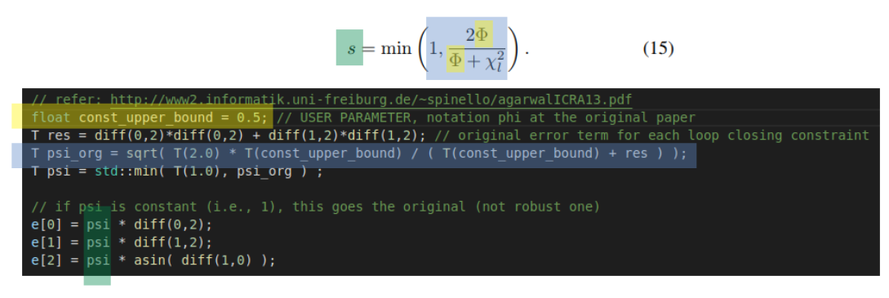

# toy-robust-backend-slam
- Goal: Toy and hands-on DCS codes for 2D graph SLAM to understand the importance of a robust back-end system for robust SLAM.

### Notes
- The almost parts of this repository's code are barrowed from https://github.com/mpkuse/toy-pose-graph-optimization-ceres.
- I added some useful other datasets from [Luca Carlone's site](https://lucacarlone.mit.edu/datasets/). 
- I refactored codes and directory structures for better understanding.
- I added my own results and discussions with repect to DCS On/Off, a portion of outliers, and datasets. 
- I added code-block-explanation slides.
- (To do) I extended the original 2D example to 3D (i.e., SE3) examples. 

### How to run 
- move to DCS-ceres directory just run (dependency: ceres is required)
```
$ cd DCS-ceres
$ ./do_build.sh DATASET_NAME_WITHOUGH_DOTG2O NUM_OUTLIER_LOOPS DSC_ON
```
- for example, 
```
$ ./do_build.sh INTEL 50 1 # USING DCS, with 50 outlier loops on INTEL dataset
$ ./do_build.sh INTEL 50 0 # NOT USING DCS, with 50 outlier loops on INTEL dataset
```

### What is DCS?
- As its name, literally, it dynamically scales the covariance. 
- At the code level, it is more easy to understand (just 4 lines are added.)
- If $\psi$ (denoted $s$ in the original paper) is equal to $1$, it is same as the original one, which is not robust to the outlier loops.



- Here, the detailed exaplanation of the mathematical derivation is ommitted and refer the [original paper](http://www2.informatik.uni-freiburg.de/~spinello/agarwalICRA13.pdf) 
- Simply, $\Phi$ is a free parameter (i.e., user parameter). In the author's [original paper [ICRA 13)](http://www2.informatik.uni-freiburg.de/~spinello/agarwalICRA13.pdf), they changed this value from 0.1 to 10 and reported the performances for those ranges.


### Experimental results 
#### dataset: INTEL


- These examples were acquired under default ceres solver option and $\Phi = 0.5$.
- As expected, without the robust back-end system such as DCS, the optimized graph topology easily collapsed.
- More exmaples are found in DCS-ceres/docs/{DATASET_NAME}.


